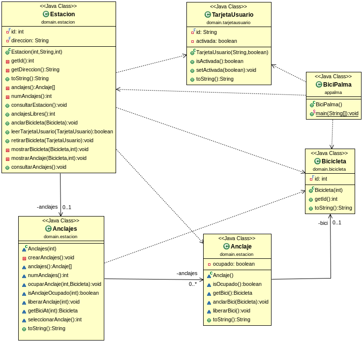

# Bicipalma

## Examen programación Java

Examen de programación DAW Dual Java de febrero de 2014, CIFP Francesc de Borja Moll, Palma (Illes Balears).

- Arrays estáticos
- Tipos primitivos
- loops
- SRP
- OCP
- Tiene una /has-a
- Composición (agregación fuerte)
- TDD :(
- Refactorización
- Gradle sourceSets

## DDD

